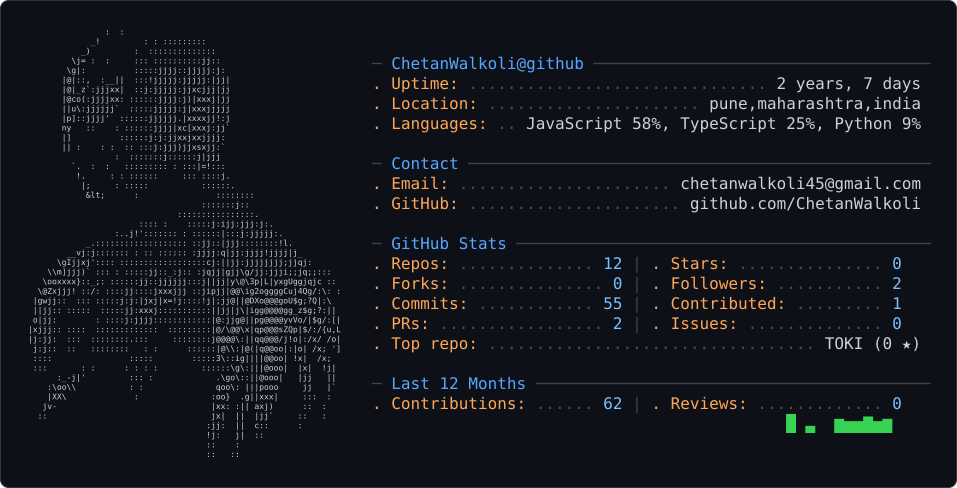

<picture>
  <source media="(prefers-color-scheme: dark)" srcset="dark_mode.svg" />
  <source media="(prefers-color-scheme: light)" srcset="light_mode.svg" />
  
</picture>

<h1 align="center">Hi 👋, I'm Chetan Walkoli</h1>

<h3 align="center">
  Full Stack Developer | Building Real-World Projects
</h3>

  

---

## 🚀 About Me

- 🔭 Currently working on **MERN Stack Projects**
- 🌱 Currently learning **Express.js, Backend Development**
- 👯 Looking to collaborate on **RAKTAM**
- 💬 Ask me about **Full Stack Development**
- 🧠 Interested in **AI, Web Development & Problem Solving**
- 📫 Reach me at **chetanwalkoli45@gmail.com**

---

## 🛠️ Tech Stack

### 💻 Programming Languages

  
  
  
  

### ⚛️ Frontend

  
  
  

### 🖥️ Backend

  
  

### 🗄️ Databases

  
  

### ☁️ Tools & Technologies

  
  
  
  
  

---

## 🚀 Featured Projects

### 🏢 EMS — Employee Management System

A MERN Stack project for managing employee-related information and operations.

🔗 **Repository:**  
https://github.com/ChetanWalkoli/EMS

---

### 🩸 RAKTAM — Blood Donation Platform

A platform designed to connect blood donors and recipients and make blood donation more accessible.

🔗 **Repository:**  
https://github.com/ChetanWalkoli/raktam

---

## 📊 GitHub Statistics

  

  

  

---

## 🏆 GitHub Trophies

  

---

## 🤝 Connect With Me

---

  ⭐ If you like my projects, consider giving them a star!

